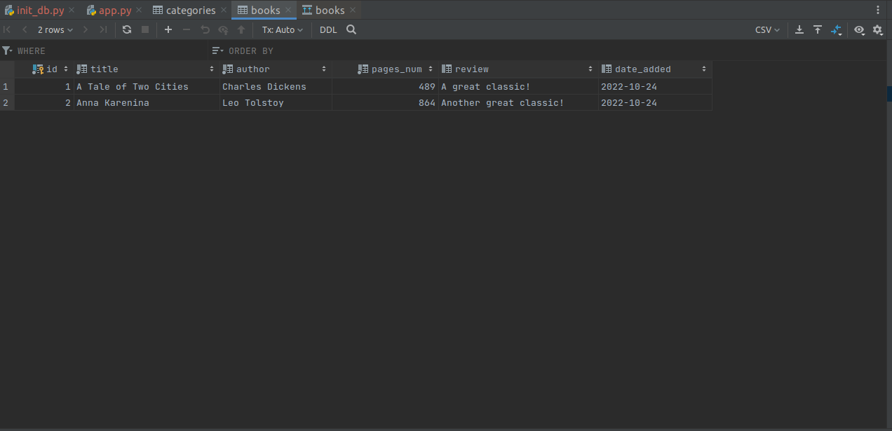
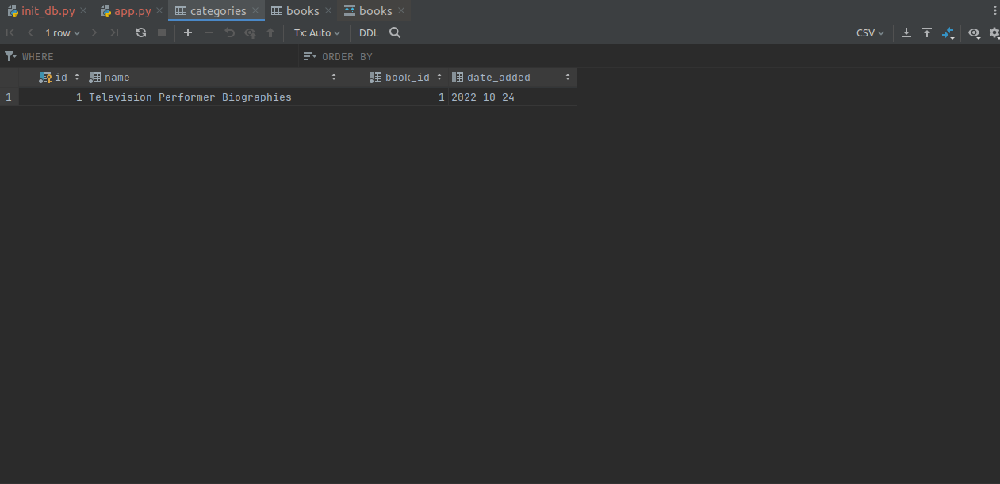

### Objectives of the project
A Flask api to make changes in the postgresql using excel as input. There will be always a unique id in the excel, I need to update the data related to that id, means replace all data in two tables related to that unique id in excel.

### Pre-condition:
- Computer has installed python3, create user sammy (or root), create database flask_db.

### Steps to install the app:
- Step 1: Create a local environment for python
- Step 2: Install the library from requirements.txt
  - Statement: ```pip install -r requirements.txt```
- Step 3: In terminal run the following 4 commands for run Flask application
  - Statement 1: ```export FLASK_APP=app```
  - Statement 2: ```export FLASK_ENV=development```
  - Statement 3: ```export DB_USERNAME="sammy"```
  - Statement 4: ```export DB_PASSWORD="password"```
- Step 4: Run the following command to initialize the data
  - Statement: ```python init_db.py```
- Step 5: Start Flask API with the following command:
  - Statement: ```flask run```
- Step 6: Send request to API with command
  - Command: ```curl --location --request POST 'http://127.0.0.1:5000/uploader' \
--form 'file=@"/home/tony/PycharmProjects/dockerizing-flask-postgresql/Sample data.xlsx"'```
  - Note: change the address /home/tony/PycharmProjects/dockerizing-flask-postgresql/Sample data.xlsx with the file address on your local computer.

### Some illustrations
#### Relationships in my database


#### Sample data in the books table


#### Sample data in the categories table


#### Sample data in the database structure


#### Result in postman


#### Result in database after update

